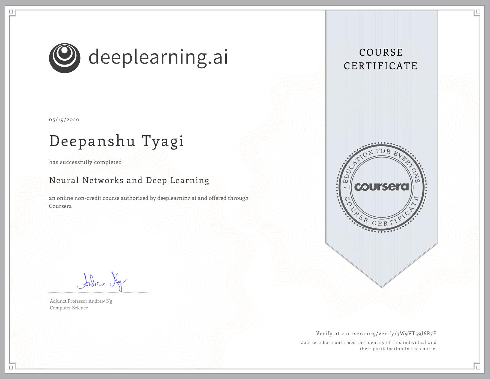

# Neural Networks and Deep Learning

In this course, you will learn the foundations of deep learning. When you finish this class, you will:

- Understand the major technology trends driving Deep Learning.
- Be able to build, train and apply fully connected deep neural networks.
- Know how to implement efficient (vectorized) neural networks.
- Understand the key parameters in a neural network's architecture.

## Week 1: Introduction to deep learning

Be able to explain the major trends driving the rise of deep learning, and understand where and how it is applied today.

- Quiz 1: [Introduction to deep learning](./Week_1/Module_1_Graded_Quiz.pdf)

## Week 2: Neural Networks Basics

Learn to set up a machine learning problem with a neural network mindset. Learn to use vectorization to speed up your models.

- Quiz 2: [Neural Network Basics](./Week_2/Module_2_Graded_Quiz.pdf)
- Programming Assignment: [Python Basics With Numpy](./Week_2/Python_Basics/Python_Basics_With_Numpy_v3a.ipynb)
- Programming Assignment: [Logistic Regression with a Neural Network mindset](./Week_2/Logistic_Regression/Logistic_Regression_with_a_Neural_Network_mindset_v6a.ipynb)

## Week 3: Shallow neural networks

Learn to build a neural network with one hidden layer, using forward propagation and backpropagation.

- Quiz 3: [Shallow Neural Networks](./Week_3/Module_3_Graded_Quiz.pdf)
- Programming Assignment: [Planar Data Classification with Onehidden Layer](./Week_3/Planar_data_classification/Planar_data_classification_with_onehidden_layer_v6c.ipynb)

## Week 4: Deep Neural Networks

Understand the key computations underlying deep learning, use them to build and train deep neural networks, and apply it to computer vision.

- Quiz 4: [Key concepts on Deep Neural Networks](./Week_4/Module_4_Graded_Quiz.pdf)
- Programming Assignment: [Building your Deep Neural Network Step by Step](./Week_4/Building_your_Deep_Neural_Network/Building_your_Deep_Neural_Network_Step_by_Step_v8a.ipynb)
- Programming Assignment: [Deep Neural Network Application](./Week_4/Deep_Neural_Network_Application/Deep_Neural_Network_-_Application_v8.ipynb)

## Course Certificate

