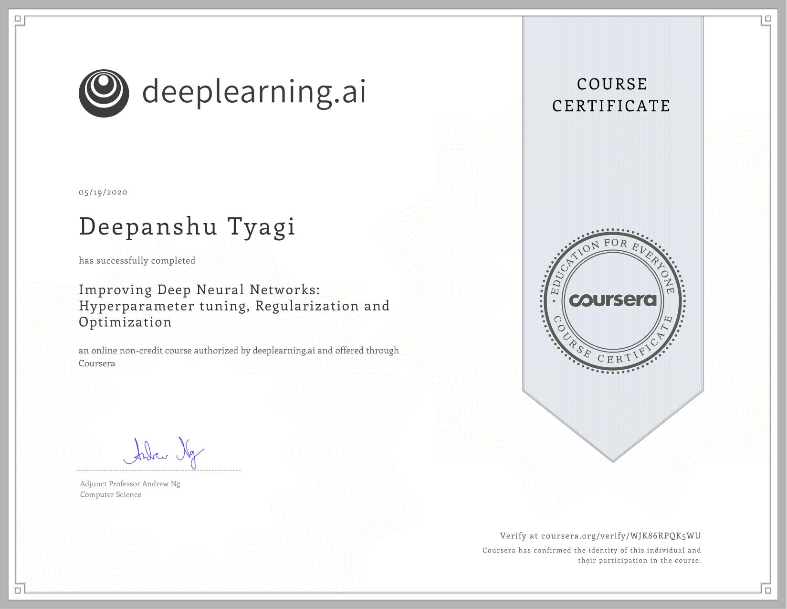

# Improving Deep Neural Networks: Hyperparameter tuning, Regularization and Optimization

This course will teach you the "magic" of getting deep learning to work well. Rather than the deep learning process being a black box, you will understand what drives performance, and be able to more systematically get good results. You will also learn TensorFlow.

- Understand industry best-practices for building deep learning applications.
- Be able to effectively use the common neural network "tricks", including initialization, L2 and dropout regularization, Batch normalization, gradient checking.
- Be able to implement and apply a variety of optimization algorithms, such as mini-batch gradient descent, Momentum, RMSprop and Adam, and check for their convergence.
- Understand new best-practices for the deep learning era of how to set up train/dev/test sets and analyze bias/variance
- Be able to implement a neural network in TensorFlow.

## Week 1: Practical aspects of Deep Learning

### Key Concepts of Week 1

- Recall that different types of initializations lead to different results
- Recognize the importance of initialization in complex neural networks.
- Recognize the difference between train/dev/test sets
- Diagnose the bias and variance issues in your model
- Learn when and how to use regularization methods such as dropout or L2 regularization.
- Understand experimental issues in deep learning such as Vanishing or Exploding gradients and learn how to deal with them
- Use gradient checking to verify the correctness of your backpropagation implementation

### Assignment of Week 1

- Quiz 1: [Practical aspects of deep learning](./Week_1/Module_1_Graded_Quiz.pdf)
- Programming Assignment: [Initialization](./Week_1/Initialization/Initialization.ipynb)
- Programming Assignment: [Regularization](./Week_1/Regularization/Regularization_v2a.ipynb)
- Programming Assignment: [Gradient_Checking](./Week_1/Gradient_Checking/Gradien_Checking_v1.ipynb)

## Week 2: Optimization algorithms

### Key Concepts of Week 2

- Remember different optimization methods such as (Stochastic) Gradient Descent, Momentum, RMSProp and Adam
- Use random mini-batches to accelerate the convergence and improve the optimization
- Know the benefits of learning rate decay and apply it to your optimization

### Assignment of Week 2

- Quiz 2: [Optimization algorithms](./Week_2/Module_2_Graded_Quiz.pdf)
- Programming Assignment: [Optimization](./Week_2/Optimization_methods/Optimization_methods_v1b.ipynb)

## Week 3: Hyperparameter tuning, Batch Normalization and Programming Frameworks

### Key Concepts of Week 3

- Master the process of hyperparameter tuning

### Assignment of Week 3

- Quiz 3: [Hyperparameter tuning, Batch Normalization, Programming Frameworks](./Week_3/Module_3_Graded_Quiz.pdf)
- Programming Assignment: [Tensorflow](./Week_3/Tensorflow/TensorFlow_Tutorial_v3b.ipynb)

## Course Certificate

