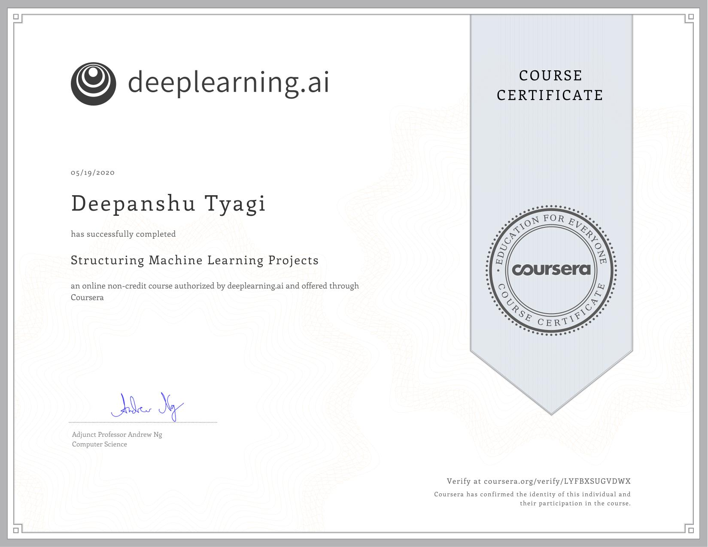

# Structuring Machine Learning Projects

Much of this content has never been taught elsewhere, and is drawn from my experience building and shipping many deep learning products. This course also has two "flight simulators" that let you practice decision-making as a machine learning project leader. This provides "industry experience" that you might otherwise get only after years of ML work experience.

- Understand how to diagnose errors in a machine learning system, and 
- Be able to prioritize the most promising directions for reducing error
- Understand complex ML settings, such as mismatched training/test sets, and comparing to and/or surpassing human-level performance
- Know how to apply end-to-end learning, transfer learning, and multi-task learning

## Week 1: ML Strategy (1)

### Key Concepts of Week 1

- Understand why Machine Learning strategy is important
- Apply satisficing and optimizing metrics to set up your goal for ML projects
- Choose a correct train/dev/test split of your dataset
- Understand how to define human-level performance
- Use human-level perform to define your key priorities in ML projects
- Take the correct ML Strategic decision based on observations of performances and dataset

### Assignment of Week 1

- Quiz 1: [Bird recognition in the city of Peacetopia](./Week_1/Module_1_Graded_Quiz.pdf)

## Week 2: ML Strategy (2)

### Key Concepts of Week 2

- Understand what multi-task learning and transfer learning are
- Recognize bias, variance and data-mismatch by looking at the performances of your algorithm on train/dev/test sets

### Assignment of Week 2

- Quiz 2: [Autonomous driving](./Week_2/Module_2_Graded_Quiz.pdf)

## Course Certificate

