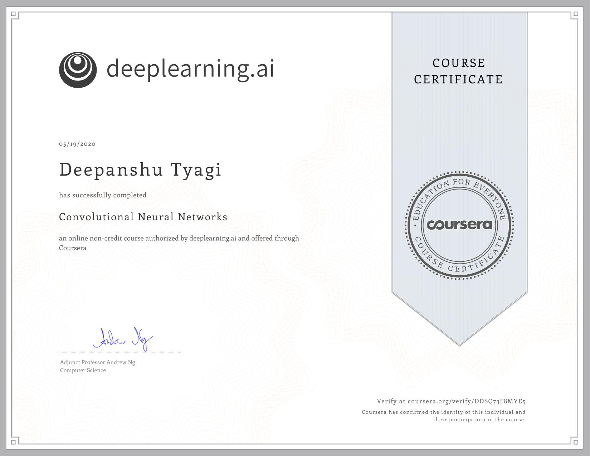

# Convolutional Neural Networks

This course will teach you how to build convolutional neural networks and apply it to image data. Thanks to deep learning, computer vision is working far better than just two years ago, and this is enabling numerous exciting applications ranging from safe autonomous driving, to accurate face recognition, to automatic reading of radiology images. 

- Understand how to build a convolutional neural network, including recent variations such as residual networks.
- Know how to apply convolutional networks to visual detection and recognition tasks.
- Know to use neural style transfer to generate art.
- Be able to apply these algorithms to a variety of image, video, and other 2D or 3D data.

## Week 1: Foundations of Convolutional Neural Networks

### Key Concepts of Week 1

- Understand the convolution operation
- Understand the pooling operation
- Remember the vocabulary used in convolutional neural network (padding, stride, filter, ...)
- Build a convolutional neural network for image multi-class classification

### Assignment of Week 1

- Quiz 1: [The basics of ConvNets](./Week_1/Module_1_Graded_Quiz.pdf)
- Programming Assignment: [Convolutional Model: step by step](./Week_1/step_by_step/Convolution_model_Step_by_Step_v2a.ipynb)
- Programming Assignment: [Convolutional Model: application](./Week_1/application/Convolution_model_Application_v1a.ipynb)

## Week 2: Deep convolutional models

### Key Concepts of Week 2

- Understand multiple foundational papers of convolutional neural networks
- Analyze the dimensionality reduction of a volume in a very deep network
- Understand and Implement a Residual network
- Build a deep neural network using Keras
- Implement a skip-connection in your network
- Clone a repository from github and use transfer learning

### Assignment of Week 2

- Quiz 2: [Deep convolutional models](./Week_2/Module_2_Graded_Quiz.pdf)
- Programming Assignment: [Residual Networks](./Week_2/ResNets/Residual_Networks_v2a.ipynb)

## Week 3: Convolutional Neural Networks

### Key Concepts of Week 3

- Understand the challenges of Object Localization, Object Detection and Landmark Finding
- Understand and implement non-max suppression
- Understand and implement intersection over union
- Understand how we label a dataset for an object detection application
- Remember the vocabulary of object detection (landmark, anchor, bounding box, grid, ...)

### Assignment of Week 3

- Quiz 3: [Detection algorithms](./Week_3/Module_3_Graded_Quiz.pdf)
- Programming Assignment: [Car detection with YOLO](./Week_3/YOLO/Autonomous_driving_application_Car_detection_v3a.ipynb)

## Week 4: Special applications: Face recognition & Neural style transfer

Discover how CNNs can be applied to multiple fields, including art generation and face recognition. Implement your own algorithm to generate art and recognize faces!

### Assignment of Week 4

- Quiz 4: [Special applications: Face recognition & Neural style transfer](./Week_4/Module_4_Graded_Quiz.pdf)
- Programming Assignment: [Art generation with Neural Style Transfer](./Week_4/Neural_Style_Transfer/Art_Generation_with_Neural_Style_Transfer_v3a.ipynb)
- Programming Assignment: [Face Recognition](./Week_4/Face_Recognition/Face_Recognition_v3a.ipynb)

## Course Certificate

