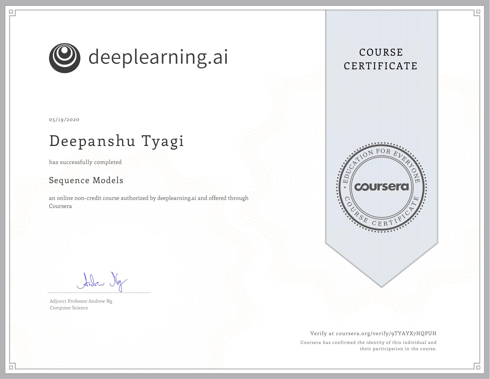

# Sequence Models

This course will teach you how to build models for natural language, audio, and other sequence data. Thanks to deep learning, sequence algorithms are working far better than just two years ago, and this is enabling numerous exciting applications in speech recognition, music synthesis, chatbots, machine translation, natural language understanding, and many others.

- Understand how to build and train Recurrent Neural Networks (RNNs), and commonly-used variants such as GRUs and LSTMs.
- Be able to apply sequence models to natural language problems, including text synthesis.
- Be able to apply sequence models to audio applications, including speech recognition and music synthesis.

## Week 1: Sequence Models

Learn about recurrent neural networks. This type of model has been proven to perform extremely well on temporal data. It has several variants including LSTMs, GRUs and Bidirectional RNNs, which you are going to learn about in this section.

### Assignment of Week 1

- Quiz 1: [Recurrent Neural Networks](./Week_1/Module_1_Graded_Quiz.pdf)
- Programming Assignment: [Building a recurrent neural network - step by step](./Week_1/step_by_step/Building_a_Recurrent_Neural_Network_Step_by_Step_v3a.ipynb)
- Programming Assignment: [Dinosaur Island - Character-Level Language Modeling](./Week_1/Dinosaur_Island/Dinosaurus_Island_Character_level_language_model_final_v3a.ipynb)
- Programming Assignment: [Jazz improvisation with LSTM](./Week_1/Jazz/Improvise_a_Jazz_Solo_with_an_LSTM_Network_v3a.ipynb)

## Week 2: Natural Language Processing & Word Embeddings

Natural language processing with deep learning is an important combination. Using word vector representations and embedding layers you can train recurrent neural networks with outstanding performances in a wide variety of industries. Examples of applications are sentiment analysis, named entity recognition and machine translation.

### Assignment of Week 2

- Quiz 2: [Natural Language Processing & Word Embeddings](./Week_2/Module_2_Graded_Quiz.pdf)
- Programming Assignment: [Operations on word vectors - Debiasing](./Week_2/Word_Vector_Representation/Operations_on_word_vectors_v2a.ipynb)
- Programming Assignment: [Emojify](./Week_2/Emojify/Emojify_v2a.ipynb)

## Week 3: Sequence models & Attention mechanism

Sequence models can be augmented using an attention mechanism. This algorithm will help your model understand where it should focus its attention given a sequence of inputs. This week, you will also learn about speech recognition and how to deal with audio data.

### Assignment of Week 3

- Quiz 3: [Sequence models & Attention mechanism](./Week_3/Module_3_Graded_Quiz.pdf)
- Programming Assignment: [Neural Machine Translation with Attention](./Week_3/Machine_Translation/Neural_machine_translation_with_attention_v4a.ipynb)
- Programming Assignment: [Trigger word detection](./Week_3/Trigger_Word_Detection/Trigger_word_detection_v1a.ipynb)

## Course Certificate

