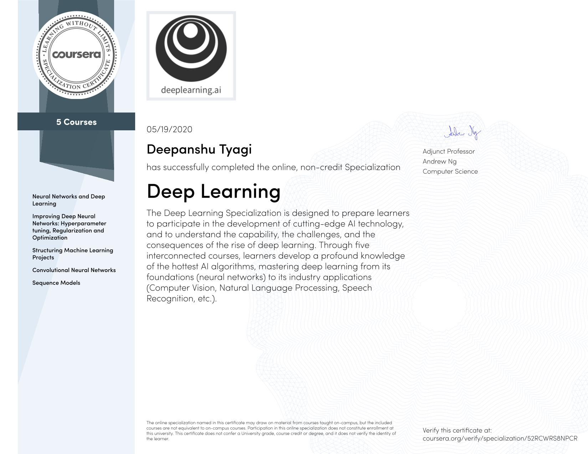

# Deep Learning

In five courses, you will learn the foundations of Deep Learning, understand how to build neural networks, and learn how to lead successful machine learning projects. You will learn about Convolutional networks, RNNs, LSTM, Adam, Dropout, BatchNorm, Xavier/He initialization, and more. You will work on case studies from healthcare, autonomous driving, sign language reading, music generation, and natural language processing. You will master not only the theory, but also see how it is applied in industry. You will practice all these ideas in Python and in TensorFlow, which we will teach.

## Content

- [Neural Networks and Deep Learning](./01_neural_networks_deep_learning)
- [Improving Deep Neural Networks: Hyperparameter tuning, Regularization and Optimization](./02_deep_neural_network)
- [Structuring Machine Learning Projects](./03_machine_learning_projects)
- [Convolutional Neural Networks](./04_convolutional_neural_networks)
- [Sequence Models](./05_nlp_sequence_models)

## Course Certificate

