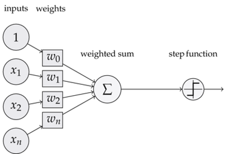
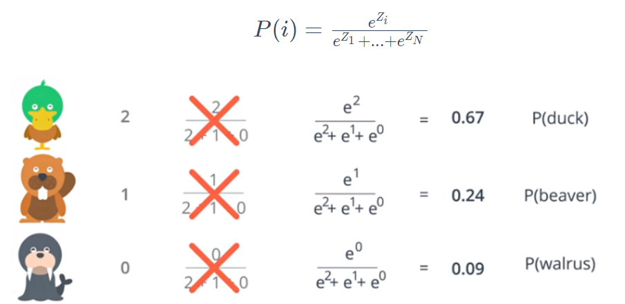

# Introduction to Deep Learning
Deep Learning is a field of Artificial intelligence that uses neural networks to make predictions. It uses lots of data to solve complex problems, usually handled by humans. 

## Topics
 - Why neural networks
 - Logistic regression
 - Neural Networks
 - Traning Neural Network
 - Softmax
 - One-Hot encoding
 - Dropout
 - Stochastic gradient descent
 - Vanishing Gradient Problem
 - Overfitting and underfitting

## Project(Predicting Bike-Sharing Patterns)
### Background 
Bike sharing systems are new generation of traditional bike rentals where whole process from membership, rental and return back has become automatic. Through these systems, user is able to easily rent a bike from a particular position and return back at another position. Currently, there are about over 500 bike-sharing programs around the world which is composed of over 500 thousands bicycles. Today, there exists great interest in these systems due to their important role in traffic, environmental and health issues. Apart from interesting real world applications of bike sharing systems, the characteristics of data being generated by these systems make them attractive for the research. Opposed to other transport services such as bus or subway, the duration of travel, departure and arrival position is explicitly recorded in these systems. This feature turns bike sharing system into a virtual sensor network that can be used for sensing mobility in the city. Hence, it is expected that most of important events in the city could be detected via monitoring these data.

### Data Set
Bike-sharing rental process is highly correlated to the environmental and seasonal settings. For instance, weather conditions, precipitation, day of week, season, hour of the day, etc. can affect the rental behaviors. The core data set is related to  the two-year historical log corresponding to years 2011 and 2012 from Capital Bikeshare system, Washington D.C., USA which is publicly available in http://capitalbikeshare.com/system-data. Weather information are extracted from http://www.freemeteo.com. 

### Dataset Licsense
<a href="http://dx.doi.org/10.1007/s13748-013-0040-3">[1] Fanaee-T, Hadi, and Gama, Joao, "Event labeling combining ensemble detectors and background knowledge", Progress in Artificial Intelligence (2013): pp. 1-15, Springer Berlin Heidelberg, doi:10.1007/s13748-013-0040-3.</a>

For further information about this dataset please contact <a href="mailto:hadi.fanaee@fe.up.pt">Hadi Fanaee-T(hadi.fanaee@fe.up.pt)</a>

## Why neural networks?
Neural Networks mimics the process of how the brain operates with neurons that fires bits of information. Let's understand it using an example taken by the Udacity course. Our task, in the example, to predict whether a student is accepted or rejected in admission based on last year's data.

In the above image, blue ones got accepted, and red ones got rejected in college admission. First, let us try to solve the problem using linear regression than we get a straight line. But sometimes the problem is more complicated there are more than and data cannot be separated using a straight line. So now, we solve our problem using the error function. An error function is simply something that tells how badly we are doing and how far we from the solution. Our target is to decrease error value consistently to reach an optimal solution.

## Logistic Regression

Perceptron as the same as human neurons given a set of inputs and produces an output. We use activation to function translates the output of the perceptron to the desired output. The neat thing about the above algorithm is that instead of computing the weights ourselves, we give them the output, and they compute the weights themselves.

Now let's design an algorithm to solve our problem using a perceptron. First, we'll be taking data and feeding it to a random single perceptron model. Then next, we'll be calculating the error generated by that model and further decreasing that error using gradient descent and iterate till the optimal model gets generated. But still, we get a straight line which suitable for line data, but for non-linear data, as shown in the below image, we require something more complex.

## Neural Networks
The solution to solve the non-linear model is Neural Networks. To build our neural network, we use the perceptron (Linear Model) as a foundation building block. We combine multiple linear models to create non-linear models, and then these combine to create even more non-linear models. Hence we get a deep neural network with multiple layers stacked together.
 
For more complicated problems like recognizing a digit from an image,  so problem turns from binary classification to multi-class classification.  For this, we add more nodes to the output layer. The number of the node in the output layer must be equal to the number of outputs.  

## Traning Neural Network
Now let's train a neural network. For this, we'll use the method known as backpropagation. In a nutshell, backpropagation algorithm is:
 - Doing a feedforward operation(predictions).
 - Comparing the output of the model with the desired output and calculating the error.
 - Running the feedforward operation backwards (backpropagation) to spread the error to each of the weights.
 - Use this to update the weights, and get a better model.
 - Continue this until we have a good model.

## Softmax
When instead of having a binary classification problem, we have multiple classes, we can compute the probability of being each class by using the softmax function.

## One-Hot encoding
We have always worked with numerical properties, but sometimes the data has non-numerical properties. To use those in our model, we have to convert them to numerical properties, and we do that using a technique called one-hot encoding. What it does is it creates a column per each possible value of the property and sets a 1 to the column value each row has and 0 otherwise. Defining it that way assures that only one of the value columns per property is 1

## Dropout
If the training set only works on some nodes and not in others, the nodes that get all the work would end with massive weights and ends up dominating all the training. To solve this problem, we can deactivate some nodes in each run, and the working nodes pick up the slack and take more part in the training. What we'll do to drop the nodes is we'll give the algorithm a parameter with the probability that each node gets dropped at a particular run. On average, each node gets the same treatment.

## Stochastic gradient descent
To avoid doing many computations and using tons of memory for a single step, we'll use stochastic gradient descent. If the data is evenly distributed, a small subset of it will give us a pretty good idea of what the gradient would be. What we do is to split all the data into several batches and run each batch through the neural network, calculate the error and its gradient and back-propagate to update the weights. Each step is less accurate than using all the data, but it's much better to take a bunch of slightly inaccurate steps than to take a good one.

## Vanishing Gradient Problem
Taking a look at the sigmoid function, we can see that when the values are very high or very low, the function is almost horizontal. That gives us an almost 0 gradient so that each step would be tiny, and we could end all the steps without arriving at the point that minimizes the error. To solve this problem, we can use another activation function like tanh or RELU function.

## Overfitting and underfitting
### Overfitting

Overfitting is like trying to kill a fly with a bazooka. We are trying a solution over complicated for the problem at hand. See what happens if we do a too specific classification and try to add a data point that was not there, the purple dog in our image. Overfitting can also be seen as studying too much, memorizing each letter in the lesson, but not knowing how to understand the information there so you can answer something not found in the book.

### Underfitting

Underfitting is trying to kill Godzilla with a fly swatter. We are trying a solution that is too simple and won't do the job. It's also called error due to bias. In the following image, we can see what happens if we do a too unspecific classification. The cat would also be classified as not animals, although it's an animal. Underfitting can also be viewed as not studying enough for an exam and failing a test.

### Model complexity graph

To validate the model, we use two sets, a training one and a testing one. The first one is used to train the network and the second one to validate the results. As long as the neural network is running, the error on the training set would be getting lower and lower. The error on the testing, on the other hand, starts to increase when the model starts to overfit. To not overfit the model, we should stop the iterations when the testing error starts to increase, and it is called early stopping.